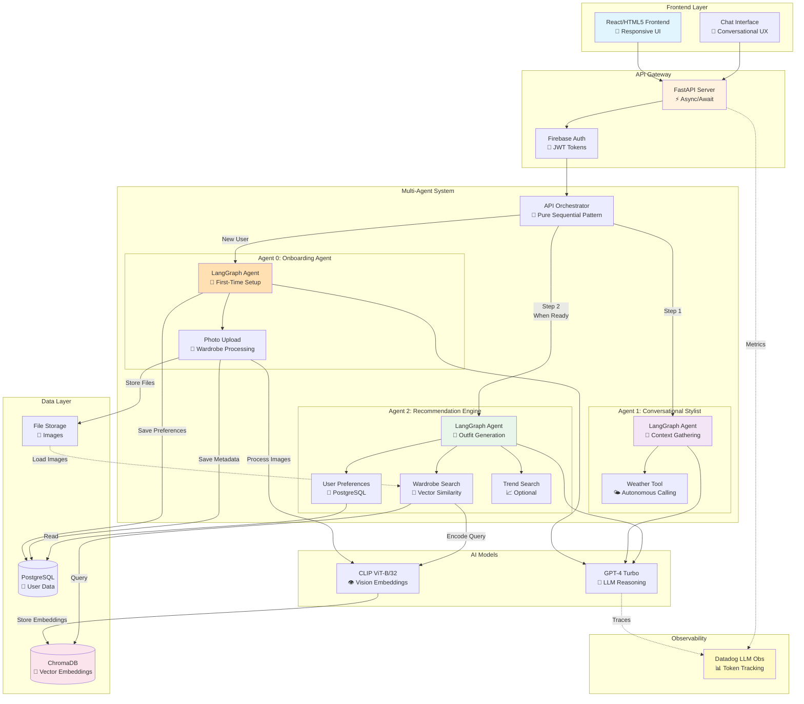
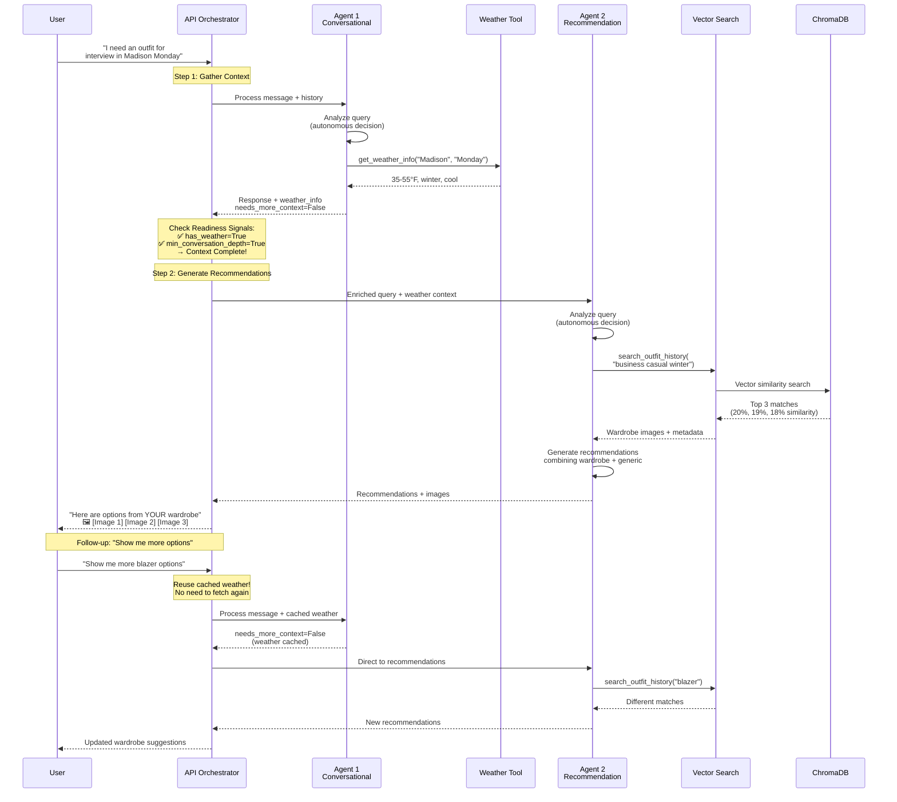
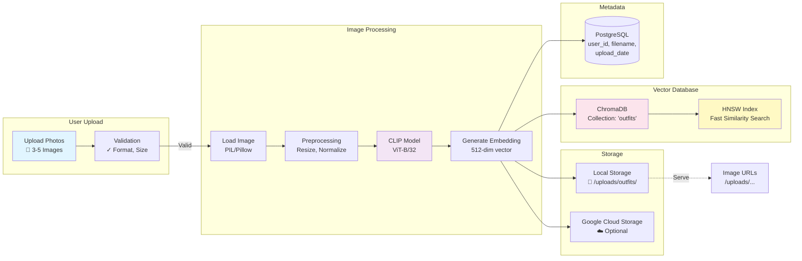
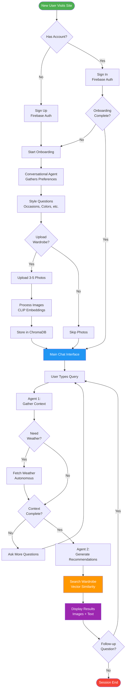
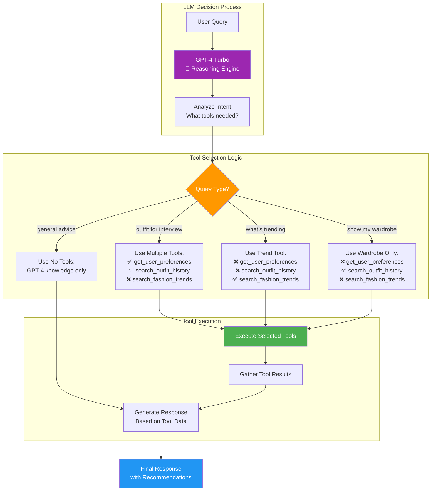
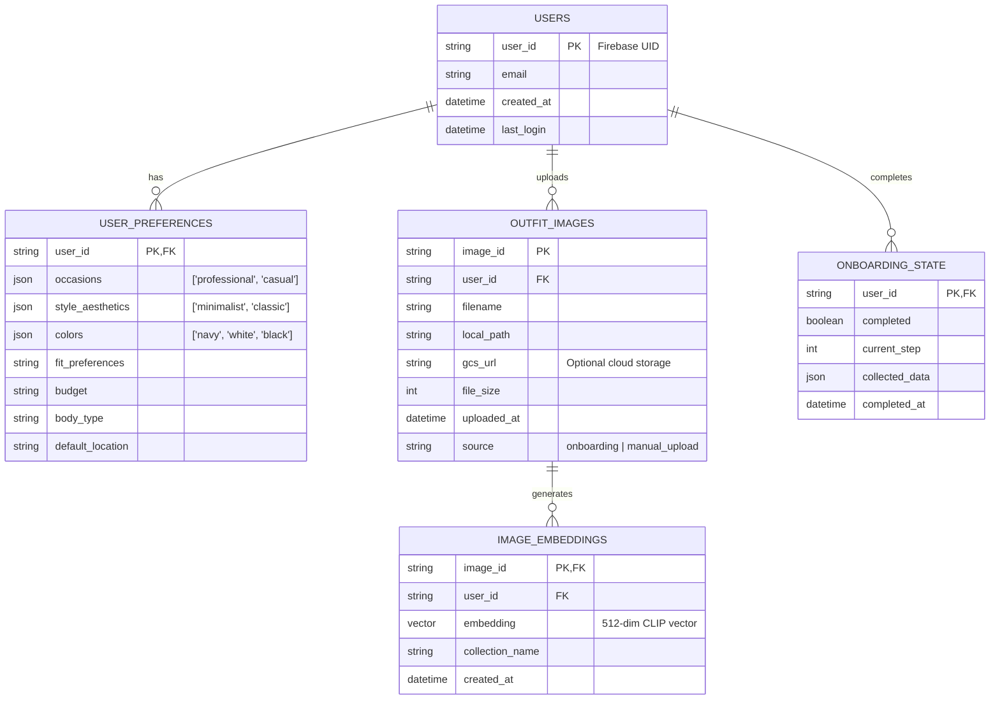
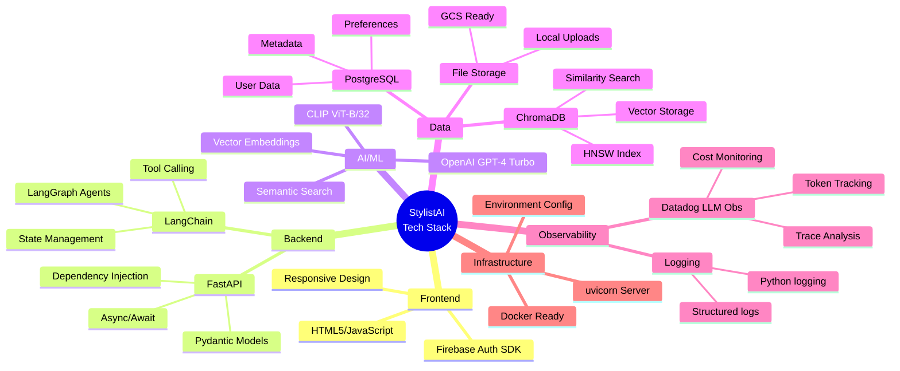
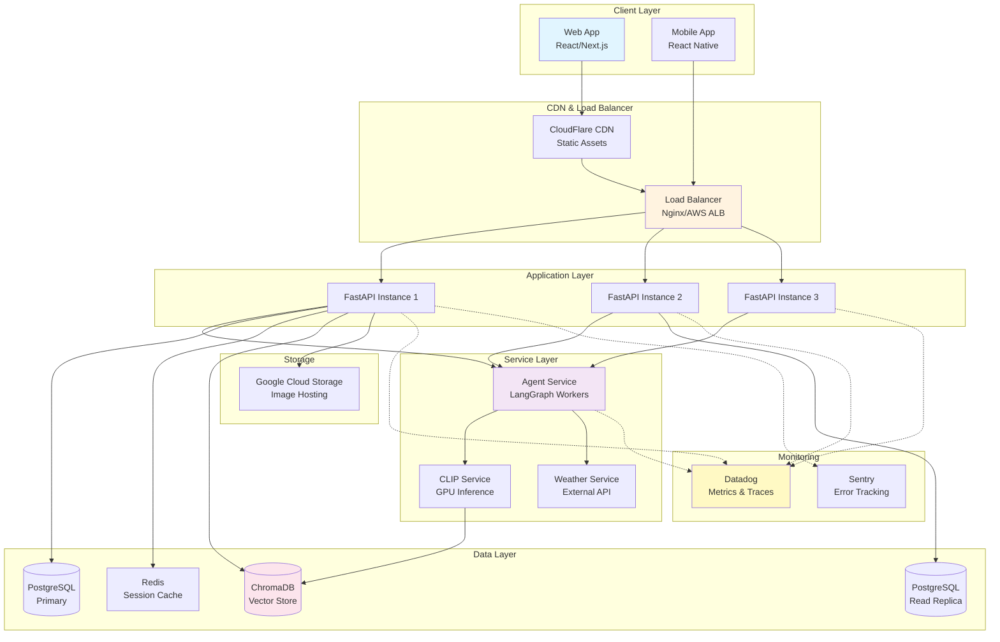

# StylistAI - Architecture Diagrams (Mermaid)

## 📊 Use These Diagrams in Your Presentation

Copy and paste these Mermaid diagrams into your presentation tool, Mermaid Live Editor, or Markdown viewer.

---

## 1️⃣ Overall System Architecture



---

## 2️⃣ Multi-Agent Conversation Flow (Pure Sequential Pattern)



---

## 3️⃣ Wardrobe Image Processing Pipeline



---

## 4️⃣ Semantic Wardrobe Search Flow

```mermaid
graph TB
    Query[User Query:<br/>"show me business casual"]

    subgraph "Query Processing"
        Text[Text Query]
        CLIPText[CLIP Text Encoder]
        QueryEmbed[Query Embedding<br/>512-dim vector]
    end

    subgraph "Vector Search"
        ChromaDB[(ChromaDB<br/>User's Wardrobe)]
        Similarity[Cosine/L2 Distance<br/>Similarity Calculation]
        Rank[Rank by Similarity<br/>Top K Results]
    end

    subgraph "Post-Processing"
        Convert[Distance → Similarity %<br/>exp(-distance/100)]
        Filter[Filter & Format<br/>Extract metadata]
        URLs[Generate Image URLs<br/>/uploads/...]
    end

    subgraph "Response"
        Results[Wardrobe Matches<br/>With Similarity Scores]
        Display[Display in UI<br/>📊 20%, 19%, 18%]
    end

    Query --> Text
    Text --> CLIPText
    CLIPText --> QueryEmbed

    QueryEmbed --> ChromaDB
    ChromaDB --> Similarity
    Similarity --> Rank

    Rank --> Convert
    Convert --> Filter
    Filter --> URLs

    URLs --> Results
    Results --> Display

    style Query fill:#e1f5ff
    style CLIPText fill:#f3e5f5
    style ChromaDB fill:#fce4ec
    style Display fill:#e8f5e9
```

---

## 5️⃣ User Journey Flow



---

## 6️⃣ Agent Decision Making (Autonomous Tool Calling)



---

## 7️⃣ Data Architecture & Storage



---

## 8️⃣ Technology Stack Overview



---

## 9️⃣ Deployment Architecture (Future Production)



---

## 🎯 How to Use These Diagrams

### **For Presentation Slides:**

1. **Copy Mermaid code** from above
2. **Paste into Mermaid Live Editor**: https://mermaid.live/
3. **Export as PNG/SVG** for slides
4. **Or use Mermaid plugins** for PowerPoint/Google Slides

### **Recommended Diagram Flow for Presentation:**

1. **Slide 3**: Overall System Architecture (#1)
2. **Slide 5** (after demo): Multi-Agent Conversation Flow (#2)
3. **Slide 6**: Semantic Wardrobe Search Flow (#4)
4. **Slide 7**: Technology Stack Overview (#8)
5. **Backup Slides**: Others for technical deep-dive questions

### **Print/Poster:**
- Use diagrams #1, #2, #4 in high resolution
- Mermaid Live Editor supports export up to 4K resolution

### **Documentation:**
- All diagrams render automatically in GitHub/GitLab
- Use in README.md or technical documentation

---

## 📝 Diagram Customization Tips

Want to modify the diagrams? Here are the Mermaid color codes used:

- Blue (`#e1f5ff`) = User-facing components
- Orange (`#fff3e0`) = API/Gateway layer
- Light Orange (`#ffe0b2`) = Onboarding/Setup components
- Purple (`#f3e5f5`) = Conversational Agent components
- Green (`#e8f5e9`) = Recommendation Agent components
- Pink (`#fce4ec`) = Vector/ML components
- Yellow (`#fff9c4`) = Observability/Monitoring

Change colors by editing the `style` lines at the bottom of each diagram.

---

**Good luck with your presentation! These diagrams will help judges understand your technical sophistication.** 🎨📊
